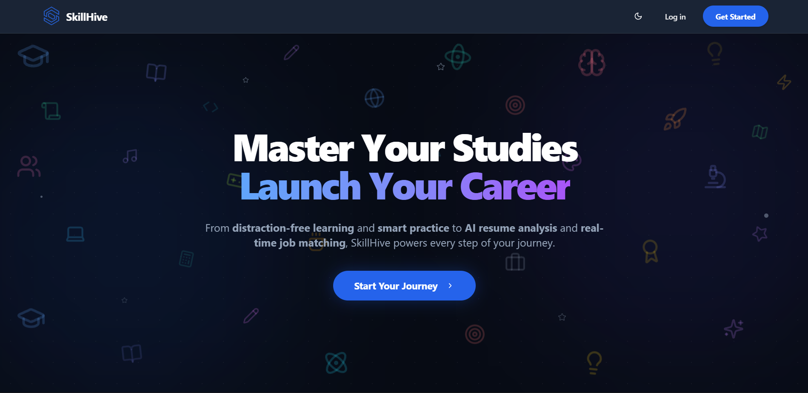

# SkillHive: AI-Powered Adaptive Learning & Career Assistant

SkillHive is a next-generation **AI-Powered Adaptive Learning Ecosystem** that evolves with every student. It goes beyond traditional learning management by using real-time analytics to personalize education, identify weak areas, and bridge the gap between academic mastery and career readiness.

### **Live Demo:** [https://skillhive-gamma.vercel.app/](https://skillhive-gamma.vercel.app/)

## Key Features

### Adaptive Learning
- **Distraction-Free Learning Features**: Smart Video Filter that automatically blocks non-educational content using AI, ensuring focused study sessions.
- **Dynamic Quizzes**: AI-generated questions (MCQs) powered by Google Gemini, tailored to specific concepts.
- **Weak Area Detection**: Automatically identifies struggle areas and tags concepts for review.
- **Personalized Recommendations**: YouTube video suggestions based on performance and learning gaps.

### Career Assistance
- **Smart Resume Analysis**: Upload a resume (PDF) to get instant AI feedback on strengths, improvements, and match scores against job descriptions.
- **Intelligent Job Search**: Real-time job listings via JSearch API, filtered by your skills and preferences.
- **Skill Gap Analysis**: Detailed reasoning for why a job is a good fit and recommendations for missing skills.

### Learning Tools
- **AI Study Coach**: A built-in chatbot that provides instant study help, answers questions, and explains complex topics using Gemini.
- **Browser Extension**: A companion Chrome extension that categorizes websites (Productive/Distraction), blocks distractions during study sessions, and syncs user context with the platform.
- **Podcast Mode**: Convert educational YouTube videos into audio-only podcasts for on-the-go learning.
- **Personal Knowledge Base**: Create and organize study notes.
- **Interactive Timetable**: Manage classes and study sessions with **Daily Goals Synchronization**.
- **Progress Tracking**: Visual analytics including "Weak Areas" detection, strength mapping, and activity heatmaps.

### Architecture
- **Frontend**: React, Vite, TypeScript, Tailwind CSS, Shadcn UI.
- **Backend/Services**: 
  - **Audio Server**: Node.js Express server for YouTube audio extraction.
  - **AI Integration**: Google Gemini (via API) for reasoning and content generation.
  - **Job Data**: JSearch API (RapidAPI) for real-time job listings.
  - **Database**: Supabase for user profiles, progress tracking, and authentication.

---

## Getting Started

**For complete installation and usage instructions, please read [SETUP.md](./SETUP.md).**

The setup guide covers:
- Prerequisites (Node.js, Supabase, yt-dlp)
- Detailed Environment Variable configuration
- How to run the Development Server and Audio Backend

---

## License

Distributed under the MIT License. See `LICENSE` for more information.
